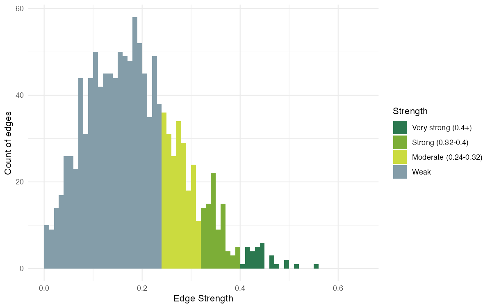

# Forrest Research Foundation — Networking Matcher

Pairs attendees of an FRF networking event by research interest, complementary
expertise, and skills each person wants to learn, using local embeddings plus
Claude-written "why you should meet" notes. Produces a per-person match card,
a full adjacency matrix for visualisation, and an interactive network graph.

## Pipeline

```
responses.csv (event sign-up form export)
        │
        ▼
networking_matcher_claude.py
        │  embeds 5 text facets per person (sentence-transformers, local)
        │  scores every pair on 3 facets, weighted into one score
        │  asks Claude for a one-line rationale on each card-worthy edge
        ▼
output/adjacency_matrix.csv   — full N×N score matrix
output/attendees.csv          — name, institution, RSVP flag
output/edges_ranked.csv       — every pair, long-form, with facet breakdown
output/match_cards.md         — top-K matches per person (gitignored — real names)
        │
        ▼
networking_visualise.py                 match_cards_to_docx.py
        │                                        │
        ▼                                        ▼
output/network_interactive.html   output/match_cards.docx (gitignored)
output/network_static.png
```

### Running it

```bash
pip install anthropic sentence-transformers pandas numpy requests
export ANTHROPIC_API_KEY=sk-ant-...
python networking_matcher_claude.py

pip install pyvis matplotlib networkx pandas Pillow
python networking_visualise.py
```

`networking_matcher_claude.py` reads `api_key.py` (gitignored) for the API
key if `ANTHROPIC_API_KEY` isn't already set, and expects `responses.csv`
(also gitignored — it's the raw form export with real names and emails) in
the repo root. Column names are mapped in the `COLUMN_MAP` block at the top
of the script — edit that if the form's headers change.

## What a match card means

The instructions handed out on the night explained it like this:

> Find your match card. This will have 4 people you should chat to tonight
> (and that should be attending), based on AI-driven predictions of your
> research interests. You will also see your top connection from those that
> have filled out the form but were unable to attend tonight, in case you
> wanted to connect offline. Note your top connections may not be
> reciprocal: you might appear on someone's top connection list even if
> they don't appear on yours.

That described the live event's config (`TOP_K_ATTENDING = 4`,
`TOP_K_NOT_ATTENDING = 1`, RSVP'd attendees only). **Since the event has now
passed**, `networking_matcher_claude.py` treats everyone as attending
regardless of RSVP (`RSVP_YES_VALUES` covers every value in the form) and the
config is `TOP_K_ATTENDING = 5`, `TOP_K_NOT_ATTENDING = 0` — no more
"attending tonight" cutoff, so match cards now cover the full attendee list
at 5 matches each.

Each match is scored from three facets, weighted in `WEIGHTS` in
`networking_matcher_claude.py`:

| Facet | Weight | What it compares |
|---|---|---|
| Interests | 0.40 | specialty + keywords, both people (symmetric) |
| Complementarity | 0.40 | what one person is looking for vs. what the other offers, either direction |
| Skill exchange | 0.20 | what one person wants to learn vs. what the other offers, either direction |

## Strength of edges

A quick pass over `output/edges_ranked.csv` to see how scores are
distributed and roughly where "worth introducing" starts:



Generated by [`edge_strength_analysis.R`](edge_strength_analysis.R) —
`Rscript edge_strength_analysis.R` from the repo root reproduces the image
above from the current `output/edges_ranked.csv`. Bucket thresholds:

| Strength | Score range |
|---|---|
| Very strong | > 0.40 |
| Strong | 0.32 – 0.40 |
| Moderate | 0.24 – 0.32 |
| Weak | ≤ 0.24 |

Most pairs land in the "Weak" band (score ≤ 0.24) — that's expected, since
most attendees don't have much in common with most other attendees. The
handful of "Very strong" edges (0.4+) are the ones worth double-checking by
hand before trusting the label Claude wrote for them.

## Viewing the network

- **Interactive graph:** https://yuval-b.github.io/frf-collab/output/network_interactive.html
  — hover a node for its top 3 matches, drag to rearrange. A QR code to this
  link was on the slide shown at the event.
- **Static graph:** `output/network_static.png`, generated by the same
  script for slides/print.
- **Password-locked match cards:** https://yuval-b.github.io/frf-collab/output/match_cards_locked.html
  — every attendee's top matches, in one searchable page. The page decrypts
  entirely in the visitor's browser (AES-256-GCM, PBKDF2-derived key); the
  password isn't in this repo or this README — it's shared with attendees
  separately. **Never commit the password anywhere in this repo** — the repo
  is public, and doing so would defeat the point of encrypting the page in
  the first place.

## Privacy notes

- `responses.csv`, `api_key.py`, and `output/match_cards*` are gitignored —
  they carry raw form answers, the API key, and per-person match text
  respectively. `output/match_cards_locked.html` is the one exception (see
  `.gitignore`): it's safe to track because it ships only ciphertext.
- `output/attendees.csv` and `output/edges_ranked.csv` **are** tracked and
  public — they carry attendee names, institutions, and numeric scores, but
  not the free-text rationale that goes on match cards.
- If you regenerate `output/match_cards.docx` or `.md`, double-check
  `git status` before committing — a file that's already tracked will keep
  showing up as trackable even though the `output/match_cards*` glob is
  meant to stop it, since `.gitignore` only blocks *new* files from being
  added, not ones already committed.
